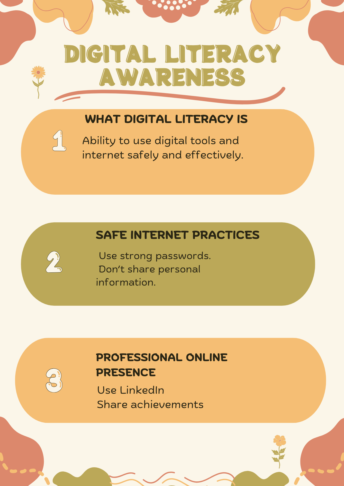

# Task 1 – Digital Literacy Awareness Infographic

## Tool Used
Canva (canva.com)

## What the Infographic Shows
The infographic is titled "Be a Smart Digital Citizen" and covers three key topics:
1. **What is Digital Literacy?** – A brief definition explaining that digital literacy is the ability to use digital technologies effectively, safely, and responsibly.
2. **Safe Internet Practices** – Tips such as using strong passwords, enabling two-factor authentication, and not sharing personal information online.
3. **Professional Online Presence** – Guidance on maintaining a clean digital footprint, setting up a LinkedIn profile, and being mindful of what you post publicly.

## Reflection
For this task, I used Canva to design a one-page infographic aimed at first-year students at VIT Bhopal. I chose Canva because it offers a wide variety of free templates and is easy to use without any design experience. My infographic covers three important topics: what digital literacy means, how to stay safe online, and how to build a professional online presence.
I used icons, colour blocks, and short text to make the information easy to read at a glance. The layout is divided into three sections, each with a distinct colour so that the reader can clearly identify each topic. I included tips like using strong passwords, not clicking suspicious links, and keeping your LinkedIn profile updated.
One thing I found interesting was how many free design resources are available for students. I initially found it difficult to decide on a layout because there were too many template options. Narrowing it down to a clean, minimal design took some time, but the final result looks professional and informative.

## File
The link to the file in canva is :

